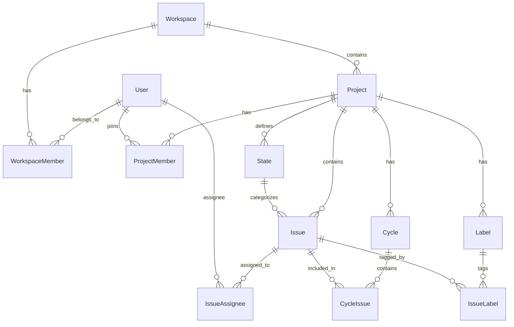
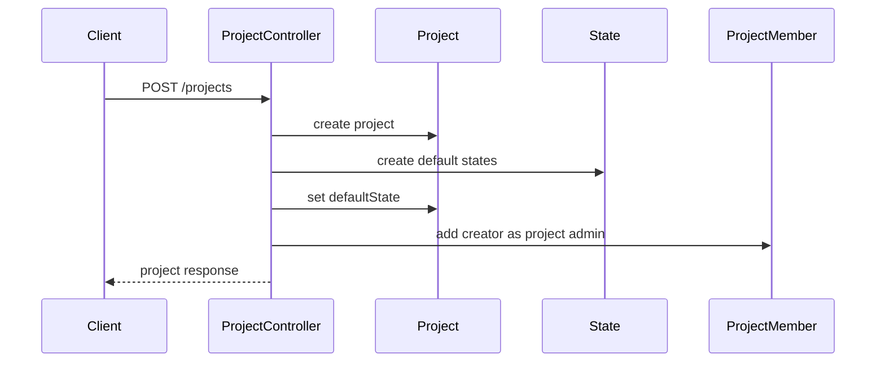
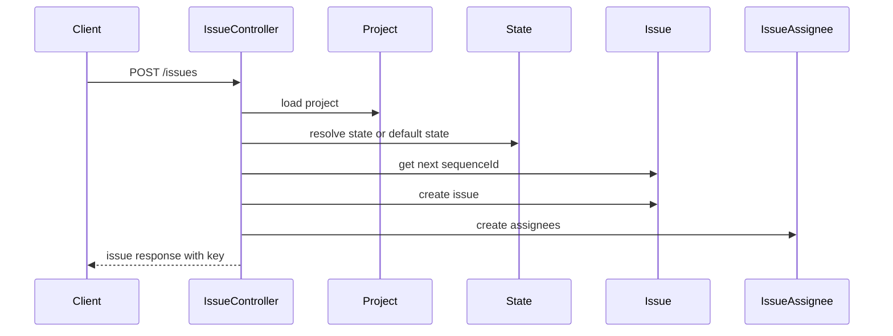
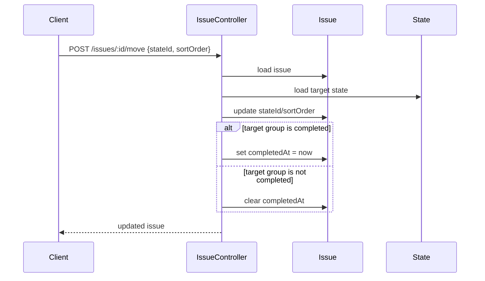

# Plane Light: Basic Kanban/Scrum Backend Design

This document captures a trimmed-down backend/domain design inspired by Plane, focused only on the basics needed for a lightweight task/project management product with Kanban and Scrum flows.

## Goal

Build a small “Plane Light” that supports:

- Workspaces/teams
- Projects
- Project members and basic roles
- Kanban states/columns
- Issues/tasks
- Assignees
- Basic prioritization and due dates
- Scrum cycles/sprints
- Adding/removing issues from cycles
- Board/list filtering

Out of scope for the first version:

- Pages
- Modules
- Intake/triage inbox
- Analytics dashboards
- Notifications
- Integrations
- Realtime collaboration
- Rich text editor internals
- Attachments
- Webhooks
- Saved views
- Favorites/recent visits
- Public spaces
- Imports/exports
- Time tracking
- Issue relations/blockers

---

## Core Domain Model

The minimal useful domain is:

```text
Workspace -> Project -> State -> Issue
                     -> Cycle -> CycleIssue
                     -> IssueAssignee
```

Optional but useful later:

```text
Project -> Label -> IssueLabel
Issue   -> IssueComment
Issue   -> Sub-issues via parentId
```

### ER Diagram



---

## Model Definitions

### User

```ts
User {
  id: uuid
  email: string
  name: string
  avatarUrl?: string
  createdAt: datetime
  updatedAt: datetime
}
```

### Workspace

Top-level tenant/team boundary.

```ts
Workspace {
  id: uuid
  name: string
  slug: string
  ownerId: uuid
  timezone: string
  createdAt: datetime
  updatedAt: datetime
}
```

Rules:

- `slug` is globally unique.
- Owner is automatically workspace admin.
- Projects live inside workspaces.

### WorkspaceMember

```ts
type Role = "admin" | "member" | "viewer";

WorkspaceMember {
  id: uuid
  workspaceId: uuid
  userId: uuid
  role: Role
  isActive: boolean
  createdAt: datetime
  updatedAt: datetime
}
```

Rules:

- A user can belong to a workspace once.
- Admins can manage workspace/project settings.
- Members can create/update issues.
- Viewers can read only.

### Project

Main work container.

```ts
Project {
  id: uuid
  workspaceId: uuid
  name: string
  identifier: string // e.g. WEB, API, OPS
  description?: string
  leadId?: uuid
  defaultStateId?: uuid
  archivedAt?: datetime
  createdAt: datetime
  updatedAt: datetime
}
```

Rules:

- `identifier` is unique per workspace.
- `name` is unique per workspace.
- `identifier` is normalized to uppercase.
- Creating a project creates default states.
- Creating a project adds the creator as project admin/member.

Default states:

```text
Backlog      -> backlog
Todo         -> unstarted
In Progress  -> started
Done         -> completed
Cancelled    -> cancelled
```

### ProjectMember

Optional in an ultra-simple v1. If omitted, workspace members can access all workspace projects.

```ts
ProjectMember {
  id: uuid
  workspaceId: uuid
  projectId: uuid
  userId: uuid
  role: Role
  isActive: boolean
  createdAt: datetime
  updatedAt: datetime
}
```

Rules:

- A user can only be a project member once.
- Project access requires workspace membership.

### State

Kanban column/workflow state.

```ts
type StateGroup =
  | "backlog"
  | "unstarted"
  | "started"
  | "completed"
  | "cancelled";

State {
  id: uuid
  workspaceId: uuid
  projectId: uuid
  name: string
  slug: string
  color: string
  sequence: number
  group: StateGroup
  isDefault: boolean
  createdAt: datetime
  updatedAt: datetime
}
```

Rules:

- State names are unique per project.
- States are ordered by `sequence`.
- One state can be marked default.
- Default state cannot be deleted.
- A state cannot be deleted while issues are in it.
- Issue completion is derived from the state group.

### Issue

Central task/work item.

```ts
type Priority = "urgent" | "high" | "medium" | "low" | "none";

Issue {
  id: uuid
  workspaceId: uuid
  projectId: uuid
  stateId: uuid
  parentId?: uuid
  sequenceId: number
  sortOrder: number
  title: string
  description?: string
  priority: Priority
  startDate?: date
  dueDate?: date
  completedAt?: datetime
  archivedAt?: datetime
  createdById: uuid
  updatedById?: uuid
  createdAt: datetime
  updatedAt: datetime
}
```

Rules:

- If no state is provided, use project default state.
- `sequenceId` is unique per project and generates issue keys like `WEB-1`.
- `sortOrder` controls board ordering inside a state/column.
- Moving to a `completed` state sets `completedAt`.
- Moving out of a `completed` state clears `completedAt`.
- Assignees must be workspace/project members.

### IssueAssignee

```ts
IssueAssignee {
  id: uuid
  workspaceId: uuid
  projectId: uuid
  issueId: uuid
  userId: uuid
  createdAt: datetime
}
```

Rules:

- Same user cannot be assigned twice to the same issue.
- Assignee must be a valid workspace/project member.

### Cycle

Scrum sprint/timebox.

```ts
type CycleStatus = "planned" | "active" | "completed";

Cycle {
  id: uuid
  workspaceId: uuid
  projectId: uuid
  name: string
  description?: string
  startDate?: datetime
  endDate?: datetime
  ownerId: uuid
  status: CycleStatus
  archivedAt?: datetime
  createdAt: datetime
  updatedAt: datetime
}
```

Rules:

- Cycle belongs to one project.
- Optional rule: only one active cycle per project.
- Completed cycles should be mostly read-only.

### CycleIssue

```ts
CycleIssue {
  id: uuid
  workspaceId: uuid
  projectId: uuid
  cycleId: uuid
  issueId: uuid
  createdAt: datetime
}
```

Rules:

- Same issue cannot be added to the same cycle twice.
- Issue must belong to the same project as the cycle.
- Optional strict Scrum rule: issue can only be in one planned/active cycle at a time.

### Optional: Label / IssueLabel

```ts
Label {
  id: uuid
  workspaceId: uuid
  projectId: uuid
  name: string
  color: string
  createdAt: datetime
  updatedAt: datetime
}

IssueLabel {
  id: uuid
  workspaceId: uuid
  projectId: uuid
  issueId: uuid
  labelId: uuid
}
```

Rules:

- Label name is unique per project.
- Issue-label pair is unique.

### Optional: IssueComment

```ts
IssueComment {
  id: uuid
  workspaceId: uuid
  projectId: uuid
  issueId: uuid
  authorId: uuid
  body: string
  createdAt: datetime
  updatedAt: datetime
}
```

---

## MVC Design

This maps Plane’s Django-style structure into a generic MVC backend:

- **Models**: database/domain entities.
- **Controllers**: HTTP/API actions and orchestration.
- **Views**: JSON serializers/API response DTOs, plus frontend screens if using full-stack MVC terminology.

### Suggested Backend Structure

```text
models/
  user
  workspace
  project
  state
  issue
  cycle
  label          optional
  comment        optional

controllers/
  auth-controller
  workspace-controller
  workspace-member-controller
  project-controller
  project-member-controller
  state-controller
  issue-controller
  board-controller
  cycle-controller
  cycle-issue-controller
  label-controller        optional
  issue-comment-controller optional

views-or-serializers/
  workspace-response
  project-response
  state-response
  issue-response
  board-response
  cycle-response
```

---

## Controllers and Responsibilities

### AuthController

```text
POST /auth/signup
POST /auth/login
POST /auth/logout
GET  /auth/me
```

Responsibilities:

- Register user.
- Authenticate user.
- Return current session/user.

### WorkspaceController

```text
GET    /workspaces
POST   /workspaces
GET    /workspaces/:slug
PATCH  /workspaces/:slug
DELETE /workspaces/:slug
```

Responsibilities:

- Create workspace.
- Assign creator as owner/admin.
- Validate unique slug.
- List workspaces current user belongs to.

### WorkspaceMemberController

```text
GET    /workspaces/:slug/members
POST   /workspaces/:slug/members
PATCH  /workspaces/:slug/members/:memberId
DELETE /workspaces/:slug/members/:memberId
```

Responsibilities:

- Add members.
- Change roles.
- Remove/deactivate members.
- Enforce admin-only management.

### ProjectController

```text
GET    /workspaces/:slug/projects
POST   /workspaces/:slug/projects
GET    /workspaces/:slug/projects/:projectId
PATCH  /workspaces/:slug/projects/:projectId
DELETE /workspaces/:slug/projects/:projectId
```

Responsibilities:

- Create project.
- Generate default states.
- Add creator as project admin/member.
- Enforce unique project identifier/name.
- Archive/delete project.

Project creation flow:



### StateController

```text
GET    /workspaces/:slug/projects/:projectId/states
POST   /workspaces/:slug/projects/:projectId/states
PATCH  /workspaces/:slug/projects/:projectId/states/:stateId
DELETE /workspaces/:slug/projects/:projectId/states/:stateId
POST   /workspaces/:slug/projects/:projectId/states/:stateId/default
POST   /workspaces/:slug/projects/:projectId/states/reorder
```

Responsibilities:

- List states ordered by `sequence`.
- Create custom states.
- Rename/update color/group.
- Mark default state.
- Prevent deletion of default state.
- Prevent deletion of non-empty state.
- Reorder board columns.

### IssueController

```text
GET    /workspaces/:slug/projects/:projectId/issues
POST   /workspaces/:slug/projects/:projectId/issues
GET    /workspaces/:slug/projects/:projectId/issues/:issueId
PATCH  /workspaces/:slug/projects/:projectId/issues/:issueId
DELETE /workspaces/:slug/projects/:projectId/issues/:issueId
POST   /workspaces/:slug/projects/:projectId/issues/:issueId/move
POST   /workspaces/:slug/projects/:projectId/issues/:issueId/assignees
DELETE /workspaces/:slug/projects/:projectId/issues/:issueId/assignees/:userId
```

Supported query params:

```text
stateId
assigneeId
priority
cycleId
search
includeDone
```

Responsibilities:

- Create issues.
- Resolve default state.
- Generate issue key via project identifier + sequence ID.
- Assign/unassign users.
- Move issues between states.
- Maintain `sortOrder`.
- Sync `completedAt` from target state group.
- List/filter issues for backlog, list, board, and sprint views.

Issue creation flow:



Issue move flow:



### BoardController

Can be separate or folded into `IssueController`.

```text
GET /workspaces/:slug/projects/:projectId/board
GET /workspaces/:slug/projects/:projectId/cycles/:cycleId/board
```

Responsibilities:

- Load project states.
- Load issues filtered by project or cycle.
- Group issues by state.
- Sort states by `sequence`.
- Sort issues by `sortOrder`.

Example response:

```json
{
  "states": [
    {
      "id": "state_todo",
      "name": "Todo",
      "group": "unstarted",
      "issues": [
        {
          "id": "issue_1",
          "key": "WEB-1",
          "title": "Build login",
          "priority": "high",
          "assignees": []
        }
      ]
    }
  ]
}
```

### CycleController

```text
GET    /workspaces/:slug/projects/:projectId/cycles
POST   /workspaces/:slug/projects/:projectId/cycles
GET    /workspaces/:slug/projects/:projectId/cycles/:cycleId
PATCH  /workspaces/:slug/projects/:projectId/cycles/:cycleId
DELETE /workspaces/:slug/projects/:projectId/cycles/:cycleId
POST   /workspaces/:slug/projects/:projectId/cycles/:cycleId/start
POST   /workspaces/:slug/projects/:projectId/cycles/:cycleId/complete
```

Responsibilities:

- Create sprint/cycle.
- Start sprint.
- Complete sprint.
- Optionally enforce one active sprint per project.
- Return cycle progress.

### CycleIssueController

```text
GET    /workspaces/:slug/projects/:projectId/cycles/:cycleId/issues
POST   /workspaces/:slug/projects/:projectId/cycles/:cycleId/issues
DELETE /workspaces/:slug/projects/:projectId/cycles/:cycleId/issues/:issueId
```

Responsibilities:

- Add issue to cycle.
- Remove issue from cycle.
- Validate issue and cycle belong to same project.
- Prevent duplicate cycle membership.

---

## Core Business Logic to Preserve from Plane

### 1. Workspace/project scoping everywhere

Every meaningful object should carry `workspaceId`; most project-level objects should also carry `projectId`.

```text
Issue belongs to Project
Project belongs to Workspace
State belongs to Project
Cycle belongs to Project
```

This keeps authorization and querying simple.

### 2. Project-local issue keys

Plane’s `Project.identifier + Issue.sequenceId` pattern is worth keeping.

```text
WEB-1
WEB-2
WEB-3
```

This is much more user-friendly than exposing UUIDs.

### 3. State groups, not just columns

Separate custom workflow names from semantic meaning.

Example:

```text
Backlog      group backlog
Todo         group unstarted
Doing        group started
Code Review  group started
Done         group completed
Won't Do     group cancelled
```

This lets users customize workflows without breaking completion/progress logic.

### 4. Completion derived from state group

Do not store independent `isDone` unless necessary.

```text
if issue.state.group == completed:
  completedAt = now
else:
  completedAt = null
```

### 5. Sparse sort ordering

Use sparse numbers for drag/drop ordering.

Initial examples:

```text
10000
20000
30000
```

Insert between two cards:

```text
newSortOrder = (before.sortOrder + after.sortOrder) / 2
```

Periodically normalize if numbers get too dense.

### 6. Safe workflow mutations

Rules:

```text
Cannot delete default state
Cannot delete state with issues
Cannot delete workspace/project without admin rights
Cannot assign non-member to issue
Cannot add issue to cycle from another project
```

### 7. Keep filters simple

Initial filters:

```text
state
assignee
priority
cycle
search
createdBy
dueDate
```

Avoid saved views/advanced filter DSL until the basic product is solid.

---

## Minimal API Map

```text
/auth/me

/workspaces
/workspaces/:slug
/workspaces/:slug/members

/workspaces/:slug/projects
/workspaces/:slug/projects/:projectId

/workspaces/:slug/projects/:projectId/states
/workspaces/:slug/projects/:projectId/states/:stateId
/workspaces/:slug/projects/:projectId/states/:stateId/default
/workspaces/:slug/projects/:projectId/states/reorder

/workspaces/:slug/projects/:projectId/issues
/workspaces/:slug/projects/:projectId/issues/:issueId
/workspaces/:slug/projects/:projectId/issues/:issueId/move
/workspaces/:slug/projects/:projectId/issues/:issueId/assignees

/workspaces/:slug/projects/:projectId/board

/workspaces/:slug/projects/:projectId/cycles
/workspaces/:slug/projects/:projectId/cycles/:cycleId
/workspaces/:slug/projects/:projectId/cycles/:cycleId/issues
/workspaces/:slug/projects/:projectId/cycles/:cycleId/board

/workspaces/:slug/projects/:projectId/labels optional
/workspaces/:slug/projects/:projectId/issues/:issueId/comments optional
```

---

## Minimal UI Views

If translating this into frontend/product screens:

### Workspace

```text
Workspace switcher
Workspace settings
Member management
```

### Project

```text
Project list
Project settings
Project members optional
```

### Kanban

```text
Project board
Backlog/list
Issue detail drawer/page
```

### Scrum

```text
Cycle list
Cycle planning/backlog
Cycle board
Cycle summary
```

### Settings

```text
Workflow/state settings
Labels optional
```

---

## Suggested Build Order

### Phase 1: Kanban core

Models:

```text
User
Workspace
WorkspaceMember
Project
State
Issue
IssueAssignee
```

Features:

```text
Create workspace
Create project
Create default states
Create issue
Move issue across board
Assign issue
Filter board
```

### Phase 2: Scrum

Models:

```text
Cycle
CycleIssue
```

Features:

```text
Create sprint
Add issues to sprint
Sprint board
Start/complete sprint
Basic progress count
```

### Phase 3: Collaboration polish

Models/features:

```text
Labels
Comments
Activity log
```

### Phase 4: Product niceties

Models/features:

```text
Saved views
Notifications
Attachments
Subtasks
Issue relations
```

---

## Summary

The essence of Plane for basic Kanban/Scrum is:

```text
Workspace
Project
State
Issue
IssueAssignee
Cycle
CycleIssue
```

The most valuable Plane ideas to replicate are:

1. Workspace/project scoping
2. Custom states grouped by semantic state groups
3. Project-local issue sequence IDs
4. Sparse sort ordering for drag/drop
5. Cycles as sprints
6. Issue completion derived from state group
7. Simple role-based permissions

This gives a small, coherent backend domain while preserving the parts of Plane that make basic task/project workflows work.
